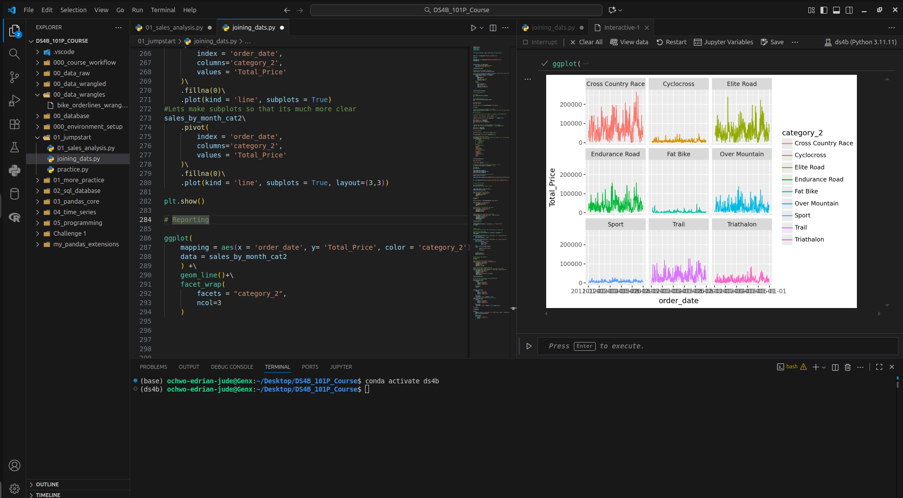
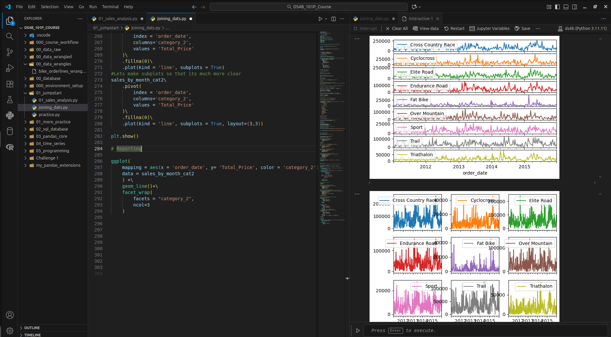

# Python for Data Automation course and practice.
In this I am practicing the use of Python for Data Science while using **Pandas, Numpys, matplotlib, plotnine** and other libraries.
Dealing with **time series** and other great factors for data manipulation while wrangling.
---

**Overview: DS4B 101-P – Python for Data Science Automation**

DS4B 101-P is a hands-on, project-based course by Business Science University that focuses on using Python for automating data science workflows and business analysis tasks. The program teaches how to build end-to-end data solutions that streamline business intelligence processes — turning repetitive analytics into efficient, reproducible systems.

**Examples of Visuals**

**Key Learning Objectives**

-Automate data import, cleaning, and transformation with pandas, numpy, and dateutil.

-Build reproducible and dynamic reports using Jupyter Notebooks, Plotnine (ggplot for Python), and matplotlib.

-Design business-focused automation pipelines for recurring tasks like sales tracking, forecasting, and performance reporting.

-Apply functional programming concepts and code organization for maintainable data science projects.

-Leverage scheduling and workflow automation (e.g., CRON jobs or Python scripts) for real-time analytics updates.

 **Core Tools and Libraries**

-pandas for data manipulation

-plotnine and matplotlib for visualization

-mizani for formatting

-os, pathlib, and glob for file automation

-openpyxl and xlsxwriter for Excel report automation

 **Project Example**

The course culminates in building an automated business reporting system, where datasets such as sales or order data are processed, analyzed, and visualized automatically — producing repeatable insights for decision-making.

 **Skills Gained**

-Data pipeline automation

-Business reporting and visualization in Python

-Scalable code architecture and reproducibility

-Automation mindset for data-driven operations
---

